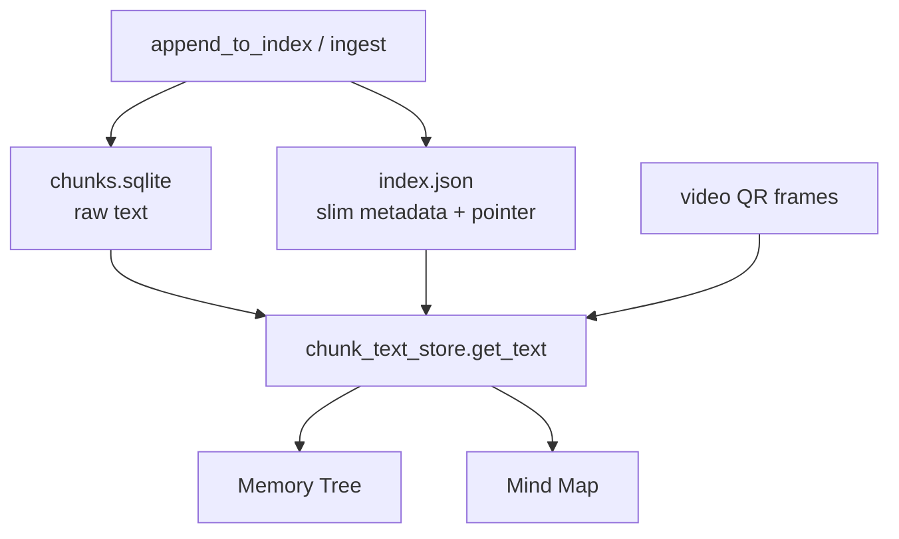
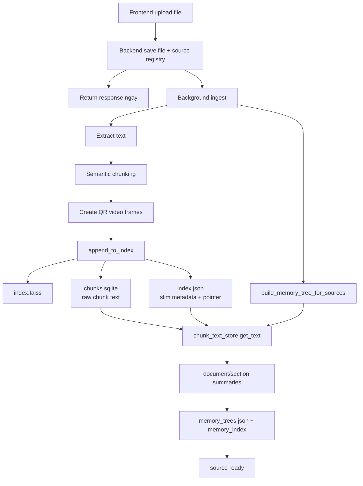
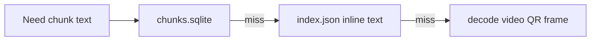

# FLOW XỬ LÝ UPLOAD FILE - CHI TIẾT

## Tổng quan

Hệ thống xử lý upload file theo mô hình 2 pha:

1. Pha 1: trả UI ngay, không block
2. Pha 2: background ingest pipeline

## UPDATE: CURRENT CHUNK STORAGE DESIGN

Đây là mô tả đúng với thiết kế hiện tại:

- Ở bước ingest, raw chunk text được ghi vào `index/chunks.sqlite`
- `index/index.json` được giữ slim, chỉ còn pointer và metadata chính như `video`, `frame_index`, `source_stem`, `parent_id`, `sub_order`, timestamp và embedding prefix
- Memory Tree và Mind Map downstream lấy text thô thông qua `chunk_text_store.get_text()`
- `chunk_text_store.get_text()` ưu tiên:
  1. `chunks.sqlite`
  2. inline `text` trong `index.json`
  3. decode QR frame on-demand

---

## Flow chi tiết

### Phase 1: Upload & response ngay

- Frontend upload file
- Backend save file
- Ghi `source_registry`
- Trả response ngay
- Frontend polling trạng thái

### Phase 2: Background processing

#### Step 1: Extract text

- Đọc nội dung file

#### Step 2: Semantic chunking

- Chia văn bản thành semantic chunks

#### Step 3: Create QR video frames

- Tạo QR frames/video nếu pipeline này được bật

#### Step 4: Embedding + Vector Store + Chunk Text Store

Trong `BE/app/domains/vectorstore/store.py`:

- chunk được embed và thêm vào vector index
- raw text của chunk được ghi vào `index/chunks.sqlite`
- `index/index.json` chỉ giữ metadata slim và pointer
- một số entry có thể vẫn còn `text` như fallback/compatibility

#### Step 5: Build Memory Tree

Trong `BE/app/domains/memory/tree.py`:

1. Load chunk metadata từ `index.json`
2. Resolve text qua `chunk_text_store.get_text()`
3. Ưu tiên `chunks.sqlite`
4. Fallback inline text hoặc decode QR frame nếu cần
5. Tạo document summary, section summary và memory nodes

#### Step 6: Complete

- `status = ready`
- `progress = 1.0`

---

## Data flow diagrams

---

## Files created/updated

1. `data/source_registry.json`
2. `input_docs/{filename}`
3. `videos/{video_name}.mp4`
4. `index/index.faiss`
5. `index/chunks.sqlite`
6. `index/index.json`
7. `memory/memory_trees.json`
8. `memory/memory_index.faiss`
9. `memory/memory_index.json`

---

## Kết luận

Upload/ingest hiện tại không còn xem `index.json` là nơi giữ full chunk text. Tầng lưu trữ đúng là:

- `chunks.sqlite` cho raw text
- `index.json` cho pointer/metadata
- `chunk_text_store` cho truy xuất text thống nhất ở downstream
