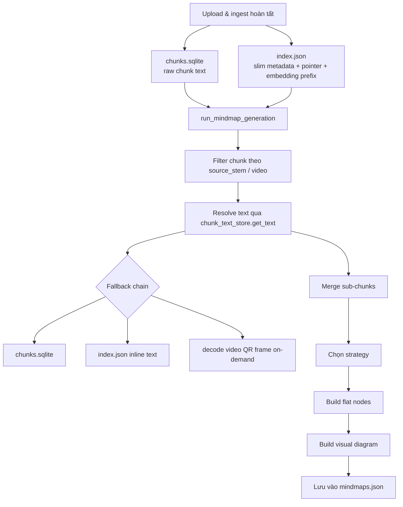
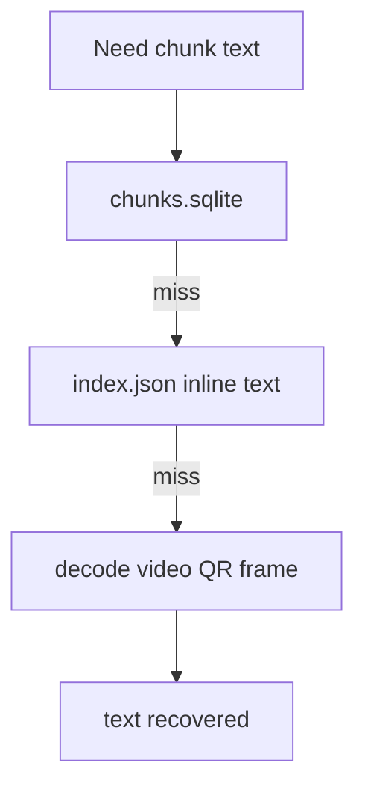
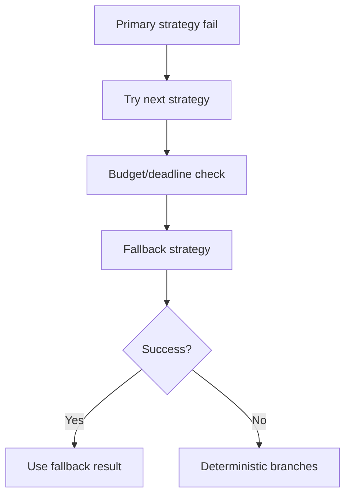

# Mindmap Generation Workflow

## Mục lục

1. [Tổng quan](#1-tổng-quan)
2. [Sơ đồ luồng tổng thể](#2-sơ-đồ-luồng-tổng-thể)
3. [Chi tiết từng bước](#3-chi-tiết-từng-bước)
4. [Các strategy chi tiết](#4-các-strategy-chi-tiết)
5. [Cache mechanism](#5-cache-mechanism)
6. [Thời gian ước tính](#6-thời-gian-ước-tính)
7. [Fallback chain](#7-fallback-chain)

---

## 1. Tổng quan

Mindmap generation là quá trình tạo sơ đồ tư duy từ nội dung tài liệu đã được chunk và embed. Hệ thống sử dụng adaptive strategy selection để chọn phương pháp phù hợp dựa trên kích thước dữ liệu.

Thiết kế hiện tại tách riêng raw chunk text khỏi metadata:

- `index/chunks.sqlite` lưu text thô của chunk ở runtime ingest.
- `index/index.json` chủ yếu lưu metadata mảnh như `video`, `frame_index`, `source_stem`, `parent_id`, `sub_order`, embedding prefix và các cờ xử lý khác.
- `index.json` có thể còn field `text` ở một số entry legacy hoặc non-video để tương thích ngược, nhưng đó không còn là nguồn text chính.

Khi worker cần text thô để tạo Mindmap, hệ thống đi qua `chunk_text_store.get_text()` thay vì phụ thuộc trực tiếp vào `m["text"]` trong metadata.

Thứ tự fallback của `chunk_text_store`:

1. `chunks.sqlite`
2. inline `text` trong `index.json`
3. decode on-demand từ video QR frames qua `(video, frame_index)`

### Thông số quan trọng

| Tham số | Giá trị |
|---------|---------|
| Embedding model | `BAAI/bge-m3` hoặc model cấu hình hiện tại |
| Mindmap LLM | Theo mode (`FAST`, `BALANCED`, `QUALITY`) |
| Text source for chunks | `chunk_text_store.get_text()` |
| Metadata registry | `index/index.json` |

---

## 2. Sơ đồ luồng tổng thể



Ý nghĩa:

- `index.json` vẫn là registry metadata của chunk, nhưng không còn là kho raw text chính.
- `chunk_text_store` là tầng truy cập text thống nhất cho worker, vector store rebuild và các luồng recovery.
- Embedding prefix vẫn có thể nằm trong `index.json` để phục vụ clustering/heuristic nhanh.

---

## 3. Chi tiết từng bước

### Bước 1: Đọc metadata và resolve chunk text

Mindmap worker đọc metadata từ `index.json`, lọc theo nguồn đã chọn, sau đó resolve text qua `chunk_text_store`.

```python
# File: BE/services/mindmap/worker.py

def collect_chunks_for_sources(meta: dict, source_names: list) -> list:
    wanted = {canonical_source_stem(s) for s in (source_names or []) if (s or "").strip()}
    out = []
    for key, m in (meta or {}).items():
        if not isinstance(m, dict):
            continue
        stem = canonical_source_stem(m.get("source_stem") or m.get("video") or "")
        if stem not in wanted:
            continue

        from app.domains.vectorstore import chunk_text_store
        text = (chunk_text_store.get_text(int(key)) or (m.get("text") or "")).strip()
        out.append({
            "text": text,
            "parent_id": m.get("parent_id"),
            "sub_order": m.get("sub_order"),
            "total_parts": m.get("total_parts"),
            "is_subchunk": m.get("is_subchunk", False),
            "key": key,
            "embedding": m.get("embedding"),
        })
    return out
```

Output:

- `all_chunks_with_meta`: danh sách chunk đã resolve được text thô
- Mỗi chunk mang theo `embedding`, `parent_id`, `sub_order`, `total_parts`, `is_subchunk`

---

### Bước 2: Merge sub-chunks

Sau khi lấy được text, worker gom các sub-chunk thành logical chunk để strategy phía sau làm việc trên đơn vị nội dung hoàn chỉnh hơn.

```python
merged_logical = []
sub_groups = {}
logical_normal = []

for item in all_chunks_with_meta:
    if item.get("is_subchunk") and item.get("parent_id"):
        parent_key = str(item["parent_id"]).strip()
        sub_groups.setdefault(parent_key, []).append(item)
    else:
        logical_normal.append({
            "text": item["text"],
            "embedding": item.get("embedding"),
        })
```

Output:

- `final_logical_chunks`: chunk thường + chunk đã merge
- `final_chunks_text`: danh sách text cuối cùng dùng cho strategy

---

### Bước 3: Chọn strategy

Worker chọn strategy dựa trên:

- số chunk
- tổng độ dài context
- generation mode
- timeout
- LLM call budget

Các strategy chính:

- `single_call_schema`
- `mindmap_v2`
- `cmgn_light`
- `cmgn`
- `multilevel_fast`
- `iterative`
- deterministic fallback

---

### Bước 4: Sinh Mindmap

Sau khi có `final_logical_chunks`, worker xây sơ đồ theo strategy được chọn.

Điểm quan trọng:

- Worker làm việc trên text đã resolve qua `chunk_text_store`.
- Luồng Mindmap không nên phụ thuộc vào giả định `index.json` luôn chứa full text.
- Nếu sqlite trống hoặc index cũ chưa migrate hết, fallback inline text hoặc decode video vẫn còn hiệu lực.

---

### Bước 5: Tạo Visual Diagram

Sau khi có flat nodes, worker tạo visual diagram. Nếu đường LLM thất bại hoặc gần deadline, hệ thống fallback sang deterministic visual builder.

---

## 4. Các strategy chi tiết

### `single_call_schema`

- Dùng cho context nhỏ
- Thường chỉ cần 1 LLM call

### `mindmap_v2`

- Dùng embeddings prefix từ `index.json` khi có
- Kết hợp TF-IDF + KMeans + 1 LLM call
- Raw text của chunk vẫn được lấy qua `chunk_text_store`

### `cmgn`

- Dùng cho dữ liệu lớn hơn
- Xây coreference graph rồi sinh mindmap

### `iterative`

- Dùng cho trường hợp lớn/phức tạp
- Mở rộng nhiều vòng với budget và timeout chặt hơn

### `multilevel_fast`

- Dùng như một hướng fallback trong một số mode

---

## 5. Cache mechanism

Cache key của mindmap bám theo:

- source đã chọn
- số chunk
- tổng số ký tự
- content hash của chunks sau khi resolve text
- strategy
- model theo mode

Điều này có nghĩa cache bám theo nội dung text thực tế sau khi đã resolve, không chỉ theo metadata trong `index.json`.

---

## 6. Thời gian ước tính

| Strategy | Dữ liệu | LLM Calls | Thời gian ước tính |
|----------|----------|----------|---------------------|
| `single_call_schema` | nhỏ | 1 | 6-20 giây |
| `mindmap_v2` | vừa | 1 | 7-18 giây |
| `cmgn` | lớn | nhiều | 35-70 giây |
| `iterative` | rất lớn | nhiều | 35-100 giây |
| `multilevel_fast` | fallback | 1-3 | phụ thuộc mode |

Thời gian không phụ thuộc vào việc `index.json` có full text hay không, vì đường đọc text chính hiện tại là `chunks.sqlite` qua `chunk_text_store`.

---

## 7. Fallback chain





Tóm lại:

- `index.json` là metadata-first
- `chunks.sqlite` là raw-text-first
- `chunk_text_store` là điểm truy cập text duy nhất nên được tài liệu hóa cho luồng Mindmap
