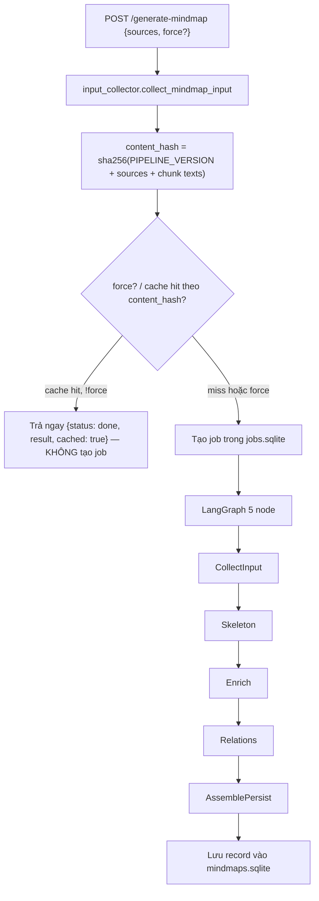
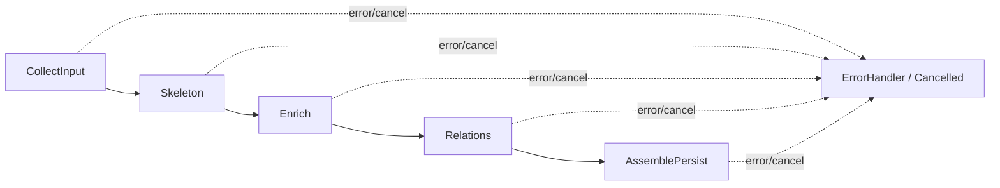

# Mindmap Generation Workflow

## Mục lục

1. [Tổng quan](#1-tổng-quan)
2. [Sơ đồ luồng tổng thể](#2-sơ-đồ-luồng-tổng-thể)
3. [Input & content hash](#3-input--content-hash)
4. [Cache thật (mindmaps.sqlite)](#4-cache-thật-mindmapssqlite)
5. [5 node của graph](#5-5-node-của-graph)
6. [Degraded & huỷ](#6-degraded--huỷ)
7. [Cấu hình & triển khai](#7-cấu-hình--triển-khai)
8. [Thời gian đo thật](#8-thời-gian-đo-thật)
9. [FE v3: sinh nền + viewer mind-elixir + edit](#9-fe-v3-sinh-nền--viewer-mind-elixir--edit)

---

## 1. Tổng quan

Mindmap generation là **skeleton-first**: có đúng MỘT đường xử lý cho mọi tài liệu, không còn khái
niệm mode (fast/balanced/quality) hay chọn strategy theo kích thước dữ liệu. Cấu trúc mục lục của
tài liệu (heading, section) được dùng làm khung sơ đồ ngay lập tức, không cần LLM; LLM chỉ được gọi
để "làm giàu" nội dung từng nhánh và tìm quan hệ chéo giữa các nhánh.

Nguyên tắc cốt lõi: **không bao giờ trả về rác**. Nếu LLM lỗi/timeout ở một nhánh, nhánh đó vẫn giữ
nguyên khung xương (title lấy từ heading) và toàn bộ mindmap vẫn được lưu, chỉ đánh dấu
`generator.degraded = true` kèm danh sách `missing` (`["enrich"]` và/hoặc `["relations"]`).

Endpoint `POST /generate-mindmap {sources, force?}` nhận danh sách nguồn, gom input, tính
`content_hash`, rồi:

- Nếu đã có mindmap với cùng `content_hash` và `force` không bật → trả ngay
  `{"status": "done", "result": cached, "cached": true}` (200), KHÔNG tạo job mới.
- Ngược lại → tạo job (`jobs.sqlite`), chạy LangGraph 5 node ở nền, trả `{"job_id", "status": "started"}` (202).
  FE poll `GET /mindmap-status/<job_id>`.

### Thông số quan trọng

| Tham số | Giá trị |
|---------|---------|
| Text source for chunks | `chunk_text_store.get_text()` (qua `app/domains/mindmap/input_collector.py`) |
| Cache key | `content_hash` = sha256(`PIPELINE_VERSION` + sorted source stems + toàn bộ chunk text) |
| Cache store | `memory/mindmaps.sqlite` (bảng `mindmaps`, index theo `content_hash`) |
| Job store | `jobs.sqlite` (dùng chung mọi loại job — không còn dict in-memory riêng cho mindmap) |
| Schema record | v2: `id, schema_version, title, sources, content_hash, created_at, nodes, relations, generator` |
| LLM mindmap | `MINDMAP_MODEL` (mặc định `qwen2.5:14b`), timeout `MINDMAP_LLM_TIMEOUT_SEC` (mặc định 120s) |
| Số nhánh enrich song song | `MINDMAP_ENRICH_PARALLEL` (mặc định 2) |
| gRPC service (tuỳ chọn) | `MINDMAP_SERVICE_ADDR` — bật thì pipeline chạy qua service riêng (per-stage RPC), không set thì in-proc |

---

## 2. Sơ đồ luồng tổng thể

Ý nghĩa:

- Input được gom **tại monolith** (`app/domains/mindmap/input_collector.py`), không phải ở
  worker/service — service (nếu bật gRPC) chỉ nhận dữ liệu qua wire, không tự đọc đĩa.
- `content_hash` là khoá cache DUY NHẤT: cache hit → không có bước tạo job/graph nào chạy.
- Toàn bộ pipeline là MỘT graph, không rẽ nhánh theo strategy hay mode.

---

## 3. Input & content hash

`app/domains/mindmap/input_collector.py::collect_mindmap_input(index_meta_path, source_names)`:

1. Lọc metadata trong `index.json` theo `source_stem` (canonical qua `shared/source_id.py`).
2. Với mỗi chunk cha, resolve text qua `chunk_text_store.get_text()`; merge các sub-chunk (theo
   `parent_id`/`sub_order`) nối vào chunk cha thành một đơn vị logic. Sub-chunk mồ côi (cha không
   nằm trong lựa chọn) vẫn được gom thành chunk logic riêng.
3. Giữ `heading_path` (chuỗi `"A > B > C"`, ghi lúc chunk hoá) cho từng chunk — đây là nguyên liệu
   để Skeleton dựng cây mục lục mà không cần LLM.
4. Lấy thêm `tree_sections` từ Memory Tree (`app/domains/memory/tree.py::_load_memory_trees`) làm
   nguồn fallback khi tài liệu không có heading.

Kết quả trả về: `{"title", "sources", "chunks": [{"key", "text", "heading_path", "chunk_keys"}, ...], "tree_sections"}`.

`content_hash` (`services/mindmap/pipeline/schema.py::content_hash`) = sha256 của:
`PIPELINE_VERSION` (hiện tại `"skeleton_v1"`) + các source stem đã sort + toàn bộ text chunk. Đổi
prompt/logic pipeline (skeleton/enrich/relations) **phải** bump `PIPELINE_VERSION` để tự vô hiệu
cache cũ — nếu không, kết quả cũ (sinh từ logic cũ) sẽ tiếp tục được trả về dù code đã đổi.

---

## 4. Cache thật (mindmaps.sqlite)

Khác với thiết kế cũ (progress từng in "Đang lưu cache" nhưng không hề có bước lookup — cache "ma"),
cache hiện tại là lookup thật trong `memory/mindmaps.sqlite` (`app/domains/mindmap/store.py`):

- `get_by_hash(content_hash)`: `SELECT record_json FROM mindmaps WHERE content_hash=? ORDER BY
  created_at DESC LIMIT 1`.
- Cache hit + `force` không bật → endpoint trả thẳng record đã lưu, response có `cached: true`,
  KHÔNG có `job_id` (FE cần nhánh riêng cho response này — xem `.playbook/known-issues.md`).
- `force: true` → luôn tạo job mới, ghi đè bản ghi cùng `id` khi lưu lại (record mới có `id` UUID
  mới nên thực chất là thêm bản ghi mới, không xoá bản ghi cache cũ).
- Mindmap tạo bằng bản `mindmaps.json` cũ (trước sqlite) được migrate 1 lần vào sqlite lúc khởi
  động (`migrate_from_json`), gắn `schema_version: 1` cho record cũ (không có `content_hash` →
  không bao giờ cache-hit, sẽ được tạo lại theo pipeline mới nếu người dùng bấm lại).

---

## 5. 5 node của graph

`app/graphs/mindmap_graph.py::build_mindmap_graph` — `StateGraph(MindmapState)`, checkpointer sqlite
(`data_dir/checkpoints.sqlite`), mỗi node được bọc bởi `_guard()`: kiểm tra cờ huỷ TRƯỚC khi chạy,
bắt exception thành `error` state thay vì để graph crash.

### CollectInput

Dùng lại `mm_input`/`content_hash` đã tính ở endpoint (hoặc tính lại nếu thiếu). Nếu không còn
chunk nào cho các nguồn đã chọn → raise lỗi rõ ràng ("Không có chunk nào cho các nguồn đã chọn.").

### Skeleton (0 LLM, đo thật <1s)

`services/mindmap/pipeline/skeleton.py::build_skeleton` — thử lần lượt 3 nguồn cấu trúc, dùng
nguồn ĐẦU TIÊN cho kết quả hợp lệ (>1 node):

1. `heading_path` của chunk (tách theo `" > "`) → dựng cây mục lục nhiều cấp, node sâu nhất mang
   `chunk_refs`.
2. `tree_sections` từ Memory Tree (khi tài liệu không có heading nhưng Memory Tree đã có section).
3. TF-IDF + KMeans cluster nội dung chunk (khi không có cả heading lẫn section — cần ≥4 chunk có
   text).
4. Nếu cả 3 đều thất bại → single-root (chỉ node gốc, không nhánh).

Ngay sau khi có skeleton, node ghi preview vào job (`result.partial = {"title", "nodes"}`) — FE có
thể render khung xương ngay cả khi Enrich/Relations còn đang chạy.

### Enrich (LLM song song theo nhánh)

`services/mindmap/pipeline/enrich.py::enrich_branches` — với mỗi nhánh section top-level, gọi LLM
1 lần (song song tối đa `MINDMAP_ENRICH_PARALLEL` nhánh cùng lúc) để sinh `title` gọn hơn, `note`
tóm tắt, và 2-5 ý con (`children`) kèm `chunk_refs`. `chunk_refs` do LLM trả về bị LỌC lại theo tập
id hợp lệ của nhánh (`_descendant_refs`) trước khi chấp nhận — chặn LLM bịa tham chiếu tới chunk
không thuộc nhánh. Nhánh nào LLM lỗi/timeout → GIỮ NGUYÊN skeleton của nhánh đó (không có ý con),
đánh dấu `degraded = True` cho toàn bộ mindmap.

### Relations (1 LLM call)

`services/mindmap/pipeline/relations.py::extract_relations` — 1 lần gọi LLM duy nhất, đưa toàn bộ
danh sách nhánh (id/title/note) để tìm quan hệ NGỮ NGHĨA chéo giữa các nhánh khác nhau (không phải
quan hệ cha-con vốn đã có trong cây). Kết quả được validate lại
(`schema.py::validate_relations`): id phải tồn tại, không tự-trỏ-chính-mình, không trùng cạnh đã
có trong cây, cap tối đa 20 quan hệ. Lỗi/timeout → trả `[]` + `degraded = True`, KHÔNG chặn
pipeline.

### AssemblePersist

Ghép `nodes` (đã `sanitize_nodes`: dedupe id, kind lạ ép về `idea`, node mồ côi gắn lại về root,
cap `MAX_NODES=120`) + `relations` (đã validate) thành record schema v2
(`services/mindmap/pipeline/schema.py::build_record`), lưu vào `mindmaps.sqlite`, set job
`status=done`. Record LUÔN được tạo — kể cả khi Enrich/Relations đều thất bại toàn bộ (khi đó
`nodes` chỉ là skeleton thô, `generator.degraded=true`, `generator.missing=["enrich","relations"]`).

---

## 6. Degraded & huỷ

- **Degraded** không phải lỗi cứng — pipeline luôn hoàn tất và lưu record; `generator.degraded` +
  `generator.missing` cho FE biết phần nào chưa được LLM làm giàu để hiển thị banner + nút "Tạo
  lại" (gọi lại `force: true` để bỏ qua cache).
- **Huỷ THẬT** (khác thiết kế cũ chỉ dừng polling ở FE): `POST /mindmap-cancel/<job_id>` set cờ
  cancel trong `jobs.sqlite` (`request_cancel`). Mọi node của graph (qua `_guard()`), và cả vòng
  lặp theo batch trong `enrich_branches`/trước lệnh gọi LLM trong `extract_relations`, đều kiểm tra
  cờ này trước khi tiếp tục — huỷ giữa chừng sẽ dừng ở batch hiện tại và KHÔNG persist record.

---

## 7. Cấu hình & triển khai

| Env | Mặc định | Ý nghĩa |
|-----|----------|---------|
| `MINDMAP_MODEL` | `qwen2.5:14b` | Model dùng cho cả Enrich lẫn Relations |
| `MINDMAP_LLM_TIMEOUT_SEC` | `120` | Timeout mỗi lời gọi LLM (per-branch enrich, relations) |
| `MINDMAP_ENRICH_PARALLEL` | `2` | Số nhánh enrich chạy song song mỗi batch |
| `MINDMAP_SERVICE_ADDR` | (trống) | Nếu set → dùng `GrpcMindmapPipeline` (service riêng), mặc định chạy in-proc (`LocalMindmapPipeline`) |

Khi `MINDMAP_SERVICE_ADDR` được set, monolith gọi mindmap-service qua gRPC theo TỪNG GIAI ĐOẠN
(`shared/proto/gen/mindmap_pb2_grpc.py::MindmapPipelineServicer`): `Skeleton` (unary), `EnrichBranches`
(server-streaming — service phát tiến độ từng nhánh về monolith), `Relations` (unary). Service
KHÔNG đọc `index.json`/`chunks.sqlite` trực tiếp — toàn bộ `mm_input`/`skeleton_nodes`/`nodes` được
truyền qua wire dưới dạng JSON, giữ ranh giới service sạch (không phụ thuộc đường dẫn đĩa của
monolith).

FE (`FE/src/components/mindmap/`, `FE/src/utils/`): xem mục 9 — sinh nền không mở overlay (thay
overlay-với-skeleton-preview mô tả ở bản trước), viewer `mind-elixir` (thay ReactFlow+ELK), evidence
drawer vẫn đọc chunk qua `GET /chunk-text/<id>`, chỉnh sửa tay + Lưu qua `PUT /mindmaps/<id>` (mục 9.3).

---

## 8. Thời gian đo thật

Đo thật ngày 2026-07-04 trên Ollama `qwen3.5:9b` chạy CPU local (không phải ước lượng lý thuyết):

| Tài liệu | Skeleton | Enrich | Relations | Tổng | Ghi chú |
|----------|----------|--------|-----------|------|---------|
| Doc có heading, 4 chunk | 0.2s | 86.2s (3 nhánh) | 14.0s | 100.4s | 0 degraded, `chunk_refs` hợp lệ |
| Doc thật không heading, 57 chunk (cắt 6 để đo) | — | — | — | 57.9s | Fallback về TF-IDF clusters |

Cả hai đều nằm trong ngân sách "vài phút" cho một lần sinh mindmap trên CPU. Thời gian phụ thuộc
chủ yếu vào số nhánh top-level (mỗi nhánh = 1 lời gọi LLM enrich) và tốc độ phần cứng chạy model —
đo lại trên phần cứng đích trước khi đặt `MINDMAP_LLM_TIMEOUT_SEC` mặc định mới.

---

## 9. FE v3: sinh nền + viewer mind-elixir + edit

Round 2 (2026-07-04, plan `docs/superpowers/specs/2026-07-04-mindmap-ux-v3-design.md`) sửa 3 vấn đề
UX của round 1 (ReactFlow/ELK + overlay-sớm + hard-timeout poll). **BE pipeline ở mục 1-8 không đổi
gì** — round này chỉ thêm một endpoint ghi (`PUT /mindmaps/<id>`, mục 9.4) và làm lại toàn bộ tầng FE.

### 9.1 Sinh nền — không còn hard-timeout, không còn overlay sớm

Trước đây bấm "Tạo sơ đồ" mở ngay overlay fullscreen với skeleton preview, và FE tự đặt
`maxElapsedMs = jobTimeout(180s) + 10s` rồi báo lỗi "quá thời gian chờ" nếu vượt — dù job BE vẫn
chạy xong bình thường (pipeline thật mất tới vài phút, xem mục 8). Người dùng phải F5 rồi mở lại từ
danh sách mới thấy map. Đã thay bằng:

- `FE/src/utils/mindmapJob.js::createMindmapPoller` — poll tới khi BE trả status **terminal**
  (`done`/`error`/`timeout`/`cancelled`), **không có hard-timeout nào**. Interval giãn dần theo thời
  gian đã trôi qua (`pollIntervalMs`): 2s (< 30s) → 5s (< 2 phút) → 10s (sau đó). `stageLabel(status)`
  dịch `current_node`/`message` sang tiếng Việt ("Dựng khung xương…", "Làm giàu nhánh…", "Tìm quan hệ
  chéo…", "Đang lưu sơ đồ…"). Có **stall fingerprint** (không phải hard-timeout): nếu `progress`/
  `current_node`/độ dài `partial.nodes` đứng yên quá `STALL_MS=5 phút`, `onTick` báo `stalled: true`
  cho UI cảnh báo — nhưng vẫn tiếp tục poll, không tự huỷ.
- Bấm "Tạo sơ đồ" (không force) **không mở overlay** — chỉ hiện chip tiến độ nhỏ trong sidebar
  (`SidebarRight.jsx`, state `mindmapJobUi`: spinner + `label` + `progress`% + nút Huỷ; viền đổi màu
  cảnh báo khi `stalled`). Xong → toast "Sơ đồ sẵn sàng" + tự mở overlay + `fetchMindMaps()` refresh
  danh sách. Cache-hit (`content_hash` trùng, không force) đi thẳng nhánh này, bỏ qua polling —
  `runMindmapGeneration` nhánh theo `startData.status === "done" && startData.result` TRƯỚC khi kiểm
  `job_id` (known-issue cache-hit-không-job_id trong `.playbook/known-issues.md` đã đóng bằng nhánh
  này). "Tạo lại" (force=true, từ banner degraded trong viewer) VẪN mở/giữ overlay — có
  `mindmapGenerating=true` để viewer tự vẽ banner "Đang tạo lại…" + Huỷ ngay trong overlay.
- **Sống sót qua reload**: `FE/src/utils/activeMindmapJob.js` ghi `{jobId, sources, startedAt}` vào
  `localStorage` (key `mindmap_active_job`) ngay khi có `job_id`; mount lại của `SidebarRight` đọc
  key này và tự khởi poller mới (cờ `resumed=true`). Job xong trong lúc vắng mặt → chỉ toast
  ("...xong trong lúc bạn vắng mặt — mở từ danh sách"), KHÔNG tự mở overlay (tránh giật user vào
  fullscreen cho job họ có thể không nhớ đã bấm). Mọi nhánh terminal (done/error/cancelled) đều xoá
  key này.
- Toast nhẹ: `FE/src/components/ui/Toaster.jsx` (state module-level, portal riêng, `z-[10000]` — cao
  hơn overlay mindmap `z-[1000]` nên hiện được cả khi overlay đang mở), mount 1 lần trong
  `MainLayout`. Chỉ dùng cho đường mindmap — **không** refactor `alert()` toàn app.

### 9.2 Viewer: mind-elixir thay ReactFlow + ELK

`FE/src/components/mindmap/MindElixirView.jsx` (mount qua `MindMapModal.jsx`, đã bỏ empty-state
kiểm tra `data.nodes`/`data.diagram.nodes` trước khi mount viewer):

- `new MindElixir({el, direction: SIDE, editable: true, draggable: true, contextMenu: true, ...})`
  sống qua `useRef`, re-init khi `data.id` đổi (kể cả lúc "Tạo lại" swap record — xem known-issue mới
  ở mục dirty-bị-ghi-đè bên dưới).
- Theme "Phòng đọc": palette nhánh là 6 mã hex archival-ink cố định (nâu xám/lục/vàng đất/đỏ son/xanh
  chàm/nâu — trước sống ở `constants.js::BRANCH_COLORS`, file đã xoá cùng ReactFlow); nền/chữ dùng
  cssVar `--bg-base`/`--text-primary`/`--text-secondary` của theme Phòng đọc hiện có, không hardcode
  hex mới cho nền/chữ.
- Quan hệ (`relations` → `arrows` mind-elixir) vẽ nét đứt màu son kèm nhãn. Toggle "Quan hệ" ẩn/hiện
  bằng CSS thuần (`FE/src/components/mindmap/mindmap.css`, class `.me-hide-arrows`): ẩn cả
  `g[id^="a-"]` (đường arrow SVG) lẫn `.svg-label[data-type="arrow"]` (nhãn arrow) — không gọi API
  mind-elixir để bật/tắt, chỉ đổi class trên container.
- Evidence drawer (`EvidenceDrawer.jsx`, giữ nguyên component) nối qua `mind.bus.addListener(
  "selectNodes", ...)` thay vì event ReactFlow cũ — tra `note`/`chunkRefs` từ **sidecar map** (mục
  9.3), không phải từ node mind-elixir trực tiếp. Vẫn fetch nội dung chunk qua
  `GET /chunk-text/<id>` như bản trước.
- Chỉnh sửa tay: `contextMenu`/`draggable`/gõ trực tiếp của mind-elixir đều bật. Mọi event `operation`
  set `dirty=true` (chấm "● chưa lưu" trên toolbar). Nút **Lưu** chỉ hiện khi record có `id` thật
  (khác `"preview"`) và không đang generating — gọi `mindElixirToRecord(mind.getData(), sidecar,
  baseRecord)` rồi `PUT /mindmaps/<id>`, có guard `saving` (chặn double-click trong lúc request đang
  bay) độc lập với `disabled` trên nút. Đóng overlay (nút X hoặc Esc) khi đang dirty →
  `window.confirm` trước khi đóng.
- Xuất PNG: `@zumer/snapdom` chụp container mind-elixir (`mind.nodes`), nền đặc lấy từ cssVar
  `--bg-base` (tránh nền trong suốt khi mở file .png ngoài trình duyệt). Tên file
  `mindmap-<title>-<yyyymmdd>.png`.
- Giữ nguyên: overlay fullscreen + Esc đóng, banner degraded + nút "Tạo lại" (force=true, ẩn khi đang
  generating để tránh double-trigger).
- **Đã xoá** (Task 9, sau khi view mới xanh): `MindmapView.jsx`, `MindmapNodeCard.jsx`,
  `RelationEdge.jsx`, `useElkLayout.js`, `exportPng.js`, `MindmapToolbar.jsx`, `constants.js`; gỡ dep
  `reactflow`/`elkjs`/`html-to-image` khỏi `package.json`; thêm `mind-elixir@5.13.0` +
  `@zumer/snapdom`.

### 9.3 Adapter 2 chiều + sidecar (pure, test được)

`FE/src/utils/mindElixirAdapter.js` — không import `mind-elixir`, chỉ chuyển đổi shape dữ liệu:

- `recordToMindElixir(record) -> {mindData: {nodeData, arrows, direction}, sidecar}`: record v2
  (nodes phẳng + `parent`) → cây `nodeData` lồng nhau (`title` → `topic`); `relations` → `arrows`
  (nét đứt, nhãn từ `REL_LABELS` theo `type`). Node mồ côi hoặc root thừa (parent trỏ tới id không
  tồn tại, hoặc nhiều node tự nhận `kind: "root"`) được **gắn lại dưới root** thay vì bị bỏ rơi — nếu
  không, một vòng load→save sẽ âm thầm xoá cả nhánh con của node mồ côi đó.
- **Sidecar `Map<id, {note, chunkRefs, kind}>`** sống ở React layer (`sidecarRef` trong
  `MindElixirView`) — lý do: **không có gì đảm bảo mind-elixir bảo toàn field lạ** (`note`,
  `chunk_refs`, `kind`) qua các thao tác kéo/xoá/gõ của thư viện, vì `getData()` của nó chỉ trả về
  đúng shape riêng của nó (`id`, `topic`, `children`, ...). Field nghiệp vụ được giữ riêng, khớp lại
  theo `id` khi save (`mindElixirToRecord`).
- `mindElixirToRecord(mindData, sidecar, baseRecord) -> record v2`: đi lại cây `nodeData`, với mỗi
  node tra sidecar lấy `note`/`chunk_refs`/`kind` (node mới do user tạo → không có trong sidecar →
  `chunk_refs: []`, `kind` suy theo độ sâu: gốc=`root`, cấp 1=`section`, còn lại=`idea`). `arrows` →
  `relations`, giữ nguyên `type` cũ nếu cặp `source→target` đã tồn tại trong `baseRecord.relations`,
  cặp mới (user tự vẽ) mặc định `type: "relates_to"`.
- Node bị user xoá khỏi cây mind-elixir thì đơn giản không xuất hiện lại trong `walk()` → không rò
  vào record đã lưu (không cần dọn sidecar tường minh, vì `mindElixirToRecord` chỉ đi theo cây hiện
  tại, không lặp qua toàn bộ sidecar).

### 9.4 BE — một endpoint ghi: `PUT /mindmaps/<id>`

`BE/app/main.py::update_mindmap` (cạnh `delete_mindmap`), dùng `mindmap_store.get_record`/
`save_record` (`BE/app/domains/mindmap/store.py`):

- 404 nếu `id` không có trong `mindmaps.sqlite`.
- Validate body qua chính pipeline dùng lúc sinh (`services/mindmap/pipeline/schema.py`):
  `sanitize_nodes(body.nodes)` (dedupe id, kind lạ ép `idea`, node mồ côi gắn lại root, cap
  `MAX_NODES`) — nodes rỗng sau sanitize → 400. `validate_relations(body.relations, nodes)` lọc quan
  hệ trỏ tới id không tồn tại.
- **Bảo vệ** `id`/`content_hash`/`created_at`/`sources`/`schema_version` — luôn lấy từ record gốc
  trong sqlite, body không ghi đè được các field này dù có gửi lên.
- Set `updated_at` (ISO Z) + `generator.edited = true`, ghi qua `save_record` (INSERT OR REPLACE).
- **Cố ý**: record đã sửa tay vẫn giữ nguyên `content_hash` gốc → lần generate sau (không force) với
  cùng nguồn sẽ cache-hit và trả THẲNG bản đã sửa tay, không sinh lại bằng LLM (bản curated quý hơn
  bản máy sinh). Chỉ "Tạo lại" (force=true) mới bỏ qua cache và ghi đè bằng bản LLM mới.
- Không đổi gì ở `generate`/`status`/`cancel`/`delete` — pipeline sinh (mục 1-8) hoàn toàn không đụng.
