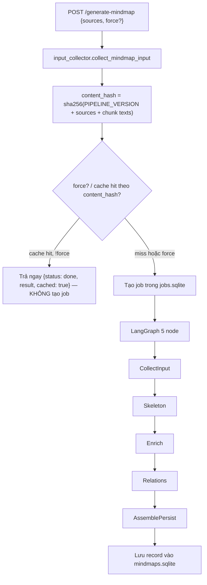
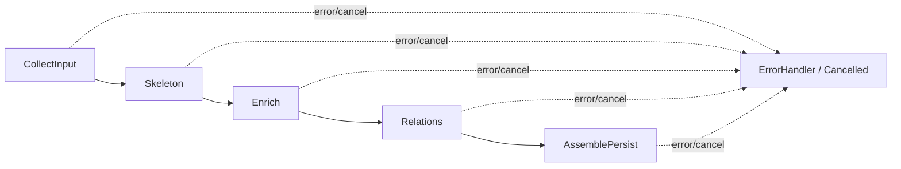

# Mindmap Generation Workflow

## Mục lục

1. [Tổng quan](#1-tổng-quan)
2. [Sơ đồ luồng tổng thể](#2-sơ-đồ-luồng-tổng-thể)
3. [Input & content hash](#3-input--content-hash)
4. [Cache thật (mindmaps.sqlite)](#4-cache-thật-mindmapssqlite)
5. [5 node của graph](#5-5-node-của-graph)
6. [Degraded & huỷ](#6-degraded--huỷ)
7. [Cấu hình & triển khai](#7-cấu-hình--triển-khai)
8. [Thời gian đo thật](#8-thời-gian-đo-thật)

---

## 1. Tổng quan

Mindmap generation là **skeleton-first**: có đúng MỘT đường xử lý cho mọi tài liệu, không còn khái
niệm mode (fast/balanced/quality) hay chọn strategy theo kích thước dữ liệu. Cấu trúc mục lục của
tài liệu (heading, section) được dùng làm khung sơ đồ ngay lập tức, không cần LLM; LLM chỉ được gọi
để "làm giàu" nội dung từng nhánh và tìm quan hệ chéo giữa các nhánh.

Nguyên tắc cốt lõi: **không bao giờ trả về rác**. Nếu LLM lỗi/timeout ở một nhánh, nhánh đó vẫn giữ
nguyên khung xương (title lấy từ heading) và toàn bộ mindmap vẫn được lưu, chỉ đánh dấu
`generator.degraded = true` kèm danh sách `missing` (`["enrich"]` và/hoặc `["relations"]`).

Endpoint `POST /generate-mindmap {sources, force?}` nhận danh sách nguồn, gom input, tính
`content_hash`, rồi:

- Nếu đã có mindmap với cùng `content_hash` và `force` không bật → trả ngay
  `{"status": "done", "result": cached, "cached": true}` (200), KHÔNG tạo job mới.
- Ngược lại → tạo job (`jobs.sqlite`), chạy LangGraph 5 node ở nền, trả `{"job_id", "status": "started"}` (202).
  FE poll `GET /mindmap-status/<job_id>`.

### Thông số quan trọng

| Tham số | Giá trị |
|---------|---------|
| Text source for chunks | `chunk_text_store.get_text()` (qua `app/domains/mindmap/input_collector.py`) |
| Cache key | `content_hash` = sha256(`PIPELINE_VERSION` + sorted source stems + toàn bộ chunk text) |
| Cache store | `memory/mindmaps.sqlite` (bảng `mindmaps`, index theo `content_hash`) |
| Job store | `jobs.sqlite` (dùng chung mọi loại job — không còn dict in-memory riêng cho mindmap) |
| Schema record | v2: `id, schema_version, title, sources, content_hash, created_at, nodes, relations, generator` |
| LLM mindmap | `MINDMAP_MODEL` (mặc định `qwen2.5:14b`), timeout `MINDMAP_LLM_TIMEOUT_SEC` (mặc định 120s) |
| Số nhánh enrich song song | `MINDMAP_ENRICH_PARALLEL` (mặc định 2) |
| gRPC service (tuỳ chọn) | `MINDMAP_SERVICE_ADDR` — bật thì pipeline chạy qua service riêng (per-stage RPC), không set thì in-proc |

---

## 2. Sơ đồ luồng tổng thể

Ý nghĩa:

- Input được gom **tại monolith** (`app/domains/mindmap/input_collector.py`), không phải ở
  worker/service — service (nếu bật gRPC) chỉ nhận dữ liệu qua wire, không tự đọc đĩa.
- `content_hash` là khoá cache DUY NHẤT: cache hit → không có bước tạo job/graph nào chạy.
- Toàn bộ pipeline là MỘT graph, không rẽ nhánh theo strategy hay mode.

---

## 3. Input & content hash

`app/domains/mindmap/input_collector.py::collect_mindmap_input(index_meta_path, source_names)`:

1. Lọc metadata trong `index.json` theo `source_stem` (canonical qua `shared/source_id.py`).
2. Với mỗi chunk cha, resolve text qua `chunk_text_store.get_text()`; merge các sub-chunk (theo
   `parent_id`/`sub_order`) nối vào chunk cha thành một đơn vị logic. Sub-chunk mồ côi (cha không
   nằm trong lựa chọn) vẫn được gom thành chunk logic riêng.
3. Giữ `heading_path` (chuỗi `"A > B > C"`, ghi lúc chunk hoá) cho từng chunk — đây là nguyên liệu
   để Skeleton dựng cây mục lục mà không cần LLM.
4. Lấy thêm `tree_sections` từ Memory Tree (`app/domains/memory/tree.py::_load_memory_trees`) làm
   nguồn fallback khi tài liệu không có heading.

Kết quả trả về: `{"title", "sources", "chunks": [{"key", "text", "heading_path", "chunk_keys"}, ...], "tree_sections"}`.

`content_hash` (`services/mindmap/pipeline/schema.py::content_hash`) = sha256 của:
`PIPELINE_VERSION` (hiện tại `"skeleton_v1"`) + các source stem đã sort + toàn bộ text chunk. Đổi
prompt/logic pipeline (skeleton/enrich/relations) **phải** bump `PIPELINE_VERSION` để tự vô hiệu
cache cũ — nếu không, kết quả cũ (sinh từ logic cũ) sẽ tiếp tục được trả về dù code đã đổi.

---

## 4. Cache thật (mindmaps.sqlite)

Khác với thiết kế cũ (progress từng in "Đang lưu cache" nhưng không hề có bước lookup — cache "ma"),
cache hiện tại là lookup thật trong `memory/mindmaps.sqlite` (`app/domains/mindmap/store.py`):

- `get_by_hash(content_hash)`: `SELECT record_json FROM mindmaps WHERE content_hash=? ORDER BY
  created_at DESC LIMIT 1`.
- Cache hit + `force` không bật → endpoint trả thẳng record đã lưu, response có `cached: true`,
  KHÔNG có `job_id` (FE cần nhánh riêng cho response này — xem `.playbook/known-issues.md`).
- `force: true` → luôn tạo job mới, ghi đè bản ghi cùng `id` khi lưu lại (record mới có `id` UUID
  mới nên thực chất là thêm bản ghi mới, không xoá bản ghi cache cũ).
- Mindmap tạo bằng bản `mindmaps.json` cũ (trước sqlite) được migrate 1 lần vào sqlite lúc khởi
  động (`migrate_from_json`), gắn `schema_version: 1` cho record cũ (không có `content_hash` →
  không bao giờ cache-hit, sẽ được tạo lại theo pipeline mới nếu người dùng bấm lại).

---

## 5. 5 node của graph

`app/graphs/mindmap_graph.py::build_mindmap_graph` — `StateGraph(MindmapState)`, checkpointer sqlite
(`data_dir/checkpoints.sqlite`), mỗi node được bọc bởi `_guard()`: kiểm tra cờ huỷ TRƯỚC khi chạy,
bắt exception thành `error` state thay vì để graph crash.

### CollectInput

Dùng lại `mm_input`/`content_hash` đã tính ở endpoint (hoặc tính lại nếu thiếu). Nếu không còn
chunk nào cho các nguồn đã chọn → raise lỗi rõ ràng ("Không có chunk nào cho các nguồn đã chọn.").

### Skeleton (0 LLM, đo thật <1s)

`services/mindmap/pipeline/skeleton.py::build_skeleton` — thử lần lượt 3 nguồn cấu trúc, dùng
nguồn ĐẦU TIÊN cho kết quả hợp lệ (>1 node):

1. `heading_path` của chunk (tách theo `" > "`) → dựng cây mục lục nhiều cấp, node sâu nhất mang
   `chunk_refs`.
2. `tree_sections` từ Memory Tree (khi tài liệu không có heading nhưng Memory Tree đã có section).
3. TF-IDF + KMeans cluster nội dung chunk (khi không có cả heading lẫn section — cần ≥4 chunk có
   text).
4. Nếu cả 3 đều thất bại → single-root (chỉ node gốc, không nhánh).

Ngay sau khi có skeleton, node ghi preview vào job (`result.partial = {"title", "nodes"}`) — FE có
thể render khung xương ngay cả khi Enrich/Relations còn đang chạy.

### Enrich (LLM song song theo nhánh)

`services/mindmap/pipeline/enrich.py::enrich_branches` — với mỗi nhánh section top-level, gọi LLM
1 lần (song song tối đa `MINDMAP_ENRICH_PARALLEL` nhánh cùng lúc) để sinh `title` gọn hơn, `note`
tóm tắt, và 2-5 ý con (`children`) kèm `chunk_refs`. `chunk_refs` do LLM trả về bị LỌC lại theo tập
id hợp lệ của nhánh (`_descendant_refs`) trước khi chấp nhận — chặn LLM bịa tham chiếu tới chunk
không thuộc nhánh. Nhánh nào LLM lỗi/timeout → GIỮ NGUYÊN skeleton của nhánh đó (không có ý con),
đánh dấu `degraded = True` cho toàn bộ mindmap.

### Relations (1 LLM call)

`services/mindmap/pipeline/relations.py::extract_relations` — 1 lần gọi LLM duy nhất, đưa toàn bộ
danh sách nhánh (id/title/note) để tìm quan hệ NGỮ NGHĨA chéo giữa các nhánh khác nhau (không phải
quan hệ cha-con vốn đã có trong cây). Kết quả được validate lại
(`schema.py::validate_relations`): id phải tồn tại, không tự-trỏ-chính-mình, không trùng cạnh đã
có trong cây, cap tối đa 20 quan hệ. Lỗi/timeout → trả `[]` + `degraded = True`, KHÔNG chặn
pipeline.

### AssemblePersist

Ghép `nodes` (đã `sanitize_nodes`: dedupe id, kind lạ ép về `idea`, node mồ côi gắn lại về root,
cap `MAX_NODES=120`) + `relations` (đã validate) thành record schema v2
(`services/mindmap/pipeline/schema.py::build_record`), lưu vào `mindmaps.sqlite`, set job
`status=done`. Record LUÔN được tạo — kể cả khi Enrich/Relations đều thất bại toàn bộ (khi đó
`nodes` chỉ là skeleton thô, `generator.degraded=true`, `generator.missing=["enrich","relations"]`).

---

## 6. Degraded & huỷ

- **Degraded** không phải lỗi cứng — pipeline luôn hoàn tất và lưu record; `generator.degraded` +
  `generator.missing` cho FE biết phần nào chưa được LLM làm giàu để hiển thị banner + nút "Tạo
  lại" (gọi lại `force: true` để bỏ qua cache).
- **Huỷ THẬT** (khác thiết kế cũ chỉ dừng polling ở FE): `POST /mindmap-cancel/<job_id>` set cờ
  cancel trong `jobs.sqlite` (`request_cancel`). Mọi node của graph (qua `_guard()`), và cả vòng
  lặp theo batch trong `enrich_branches`/trước lệnh gọi LLM trong `extract_relations`, đều kiểm tra
  cờ này trước khi tiếp tục — huỷ giữa chừng sẽ dừng ở batch hiện tại và KHÔNG persist record.

---

## 7. Cấu hình & triển khai

| Env | Mặc định | Ý nghĩa |
|-----|----------|---------|
| `MINDMAP_MODEL` | `qwen2.5:14b` | Model dùng cho cả Enrich lẫn Relations |
| `MINDMAP_LLM_TIMEOUT_SEC` | `120` | Timeout mỗi lời gọi LLM (per-branch enrich, relations) |
| `MINDMAP_ENRICH_PARALLEL` | `2` | Số nhánh enrich chạy song song mỗi batch |
| `MINDMAP_SERVICE_ADDR` | (trống) | Nếu set → dùng `GrpcMindmapPipeline` (service riêng), mặc định chạy in-proc (`LocalMindmapPipeline`) |

Khi `MINDMAP_SERVICE_ADDR` được set, monolith gọi mindmap-service qua gRPC theo TỪNG GIAI ĐOẠN
(`shared/proto/gen/mindmap_pb2_grpc.py::MindmapPipelineServicer`): `Skeleton` (unary), `EnrichBranches`
(server-streaming — service phát tiến độ từng nhánh về monolith), `Relations` (unary). Service
KHÔNG đọc `index.json`/`chunks.sqlite` trực tiếp — toàn bộ `mm_input`/`skeleton_nodes`/`nodes` được
truyền qua wire dưới dạng JSON, giữ ranh giới service sạch (không phụ thuộc đường dẫn đĩa của
monolith).

FE (`FE/src/components/mindmap/`): viewer dùng ReactFlow + ELK layout, hiển thị `relations` bằng
cạnh nét đứt màu son kèm nhãn (có toggle bật/tắt), evidence drawer đọc nội dung chunk qua
`GET /chunk-text/<id>` (dùng `chunk_refs` của node làm provenance), overlay hiện skeleton preview
(từ `result.partial`) kèm nút huỷ trong lúc job đang chạy, và banner "degraded" với nút "Tạo lại"
(gọi lại `force: true`).

---

## 8. Thời gian đo thật

Đo thật ngày 2026-07-04 trên Ollama `qwen3.5:9b` chạy CPU local (không phải ước lượng lý thuyết):

| Tài liệu | Skeleton | Enrich | Relations | Tổng | Ghi chú |
|----------|----------|--------|-----------|------|---------|
| Doc có heading, 4 chunk | 0.2s | 86.2s (3 nhánh) | 14.0s | 100.4s | 0 degraded, `chunk_refs` hợp lệ |
| Doc thật không heading, 57 chunk (cắt 6 để đo) | — | — | — | 57.9s | Fallback về TF-IDF clusters |

Cả hai đều nằm trong ngân sách "vài phút" cho một lần sinh mindmap trên CPU. Thời gian phụ thuộc
chủ yếu vào số nhánh top-level (mỗi nhánh = 1 lời gọi LLM enrich) và tốc độ phần cứng chạy model —
đo lại trên phần cứng đích trước khi đặt `MINDMAP_LLM_TIMEOUT_SEC` mặc định mới.
