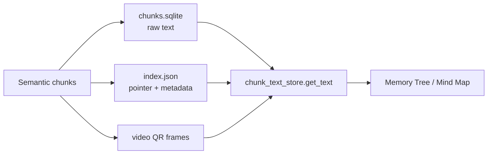
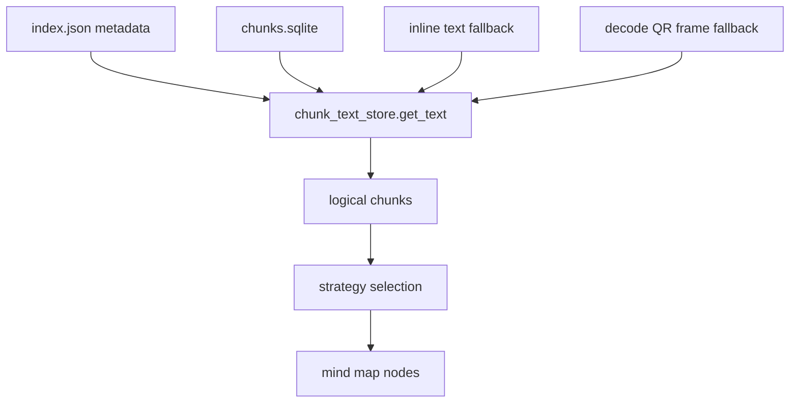

# QUY TRÌNH HỆ THỐNG TẠO SƠ ĐỒ TƯ DUY

## I. TỔNG QUAN: SƠ ĐỒ TƯ DUY TRONG HỆ THỐNG DÙNG ĐỂ LÀM GÌ?

Hệ thống tạo ra hai loại sơ đồ tư duy với mục đích khác nhau:

**Memory Tree (Cây Trí nhớ)**: Được tạo tự động sau khi người dùng tải tài liệu lên. Đây là cấu trúc cây phản ánh logic của tài liệu, giúp hệ thống hiểu được cấu trúc và mối quan hệ giữa các phần để trả lời câu hỏi có ngữ cảnh sâu hơn.

**Mind Map (Sơ đồ Tư duy)**: Được tạo theo yêu cầu của người dùng khi họ muốn xem tổng quan kiến thức. Đây là sơ đồ trực quan giúp người học dễ ghi nhớ và nắm bắt cấu trúc kiến thức.

Cả hai loại đều được xây dựng từ cùng một nguồn dữ liệu ban đầu nhưng qua các quy trình xử lý khác nhau để phục vụ mục đích riêng.

## I.5. CẬP NHẬT THIẾT KẾ LƯU CHUNK TEXT

Phần này mô tả mô hình lưu trữ/truy xuất chunk text hiện hành:

- `chunks.sqlite` là nơi lưu raw text của chunk trong runtime ingest.
- `index.json` giữ metadata mảnh và pointer như `video`, `frame_index`, `source_stem`, `parent_id`, `sub_order`, embedding prefix.
- `index.json` có thể còn `text` ở một số entry cũ hoặc trường hợp tương thích, nhưng đó chỉ là fallback.
- Memory Tree và Mind Map đều đọc text qua `chunk_text_store.get_text()`.

Thứ tự fallback:

1. `chunks.sqlite`
2. inline `text` trong `index.json`
3. decode on-demand từ video QR frames

---

## II. NGUỒN DỮ LIỆU ĐẦU VÀO

Khi người dùng tải lên một tài liệu, hệ thống trích xuất văn bản thô từ PDF, DOCX, TXT hoặc ảnh để đưa vào pipeline xử lý.

---

## III. CÁC BƯỚC XỬ LÝ CHÍNH

### BƯỚC 1: CHUẨN BỊ DỮ LIỆU

- Trích xuất nội dung từ file gốc
- Chuẩn hóa văn bản

### BƯỚC 2: CHIA NHỎ THEO NGỮ NGHĨA

- Tạo semantic chunks
- Giữ ranh giới ý nghĩa thay vì cắt theo kích thước cố định

### BƯỚC 2.5: LƯU CHUNK TEXT VÀ METADATA

- Raw chunk text được ghi vào `chunks.sqlite`
- Metadata của chunk được ghi vào `index.json`
- Video QR frames là nguồn recovery cuối cùng

### BƯỚC 3: TẠO MEMORY TREE

Memory Tree dùng chunk metadata từ `index.json`, nhưng khi cần nội dung thật của chunk để tóm tắt document/section, hệ thống đi qua `chunk_text_store.get_text()`.

Điều này có nghĩa:

- node chỉ cần giữ `chunk_refs`
- text chi tiết được lấy lại theo nhu cầu
- cùng một abstraction được dùng cho join text, build human context và recovery

### BƯỚC 4: HOÀN THIỆN MEMORY TREE

- Build document node
- Build section nodes
- Embed summary của node
- Lưu `memory_trees.json`, `memory_index.faiss`, `memory_index.json`

### BƯỚC 5: TẠO MIND MAP

Mind Map đọc metadata chunk từ `index.json`, lọc theo source rồi resolve text qua `chunk_text_store.get_text()`, sau đó:

- merge sub-chunks nếu cần
- chọn strategy
- build branches
- build visual diagram

---

## IV. DỮ LIỆU LƯU TRỮ CUỐI CÙNG

### Memory Tree

- `memory/memory_trees.json`
- `memory/memory_index.faiss`
- `memory/memory_index.json`

### Mind Map

- `memory/mindmaps.json`

### Chunk Storage Layer

- `index/chunks.sqlite` giữ raw text
- `index/index.json` giữ metadata/pointer

---

## V. KẾT LUẬN

Memory Tree và Mind Map cùng chia sẻ một cơ chế đọc chunk text thống nhất:

- ưu tiên `chunks.sqlite`
- fallback `index.json` inline text
- recovery từ video QR frames khi cần

Thiết kế này giúp `index.json` gọn hơn, giảm coupling giữa metadata và raw text, đồng thời giữ được khả năng phục hồi dữ liệu khi cần.
